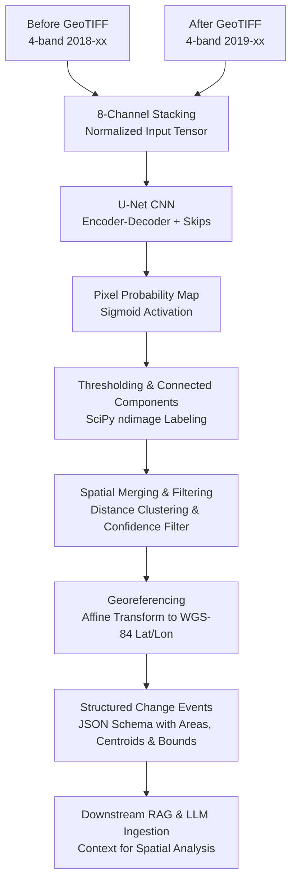

# VisionOrbit — SpaceNet 7 Urban Change Detection

[](https://www.python.org/downloads/)
[](https://pytorch.org/)
[](https://opensource.org/licenses/MIT)

VisionOrbit is an end-to-end multi-temporal satellite change detection and geographic event extraction engine. Using deep learning (U-Net) trained on the SpaceNet 7 dataset, VisionOrbit takes two multi-band satellite images of the same geographic area at different points in time, identifies likely urban developments and new building construction, and translates pixel-level probability predictions into structured, georeferenced events for downstream LLM / RAG systems.

---

## Architecture & Pipeline



---

## Directory Structure

The repository is organized into modular functional directories to maintain a clean codebase:

```text
VisionOrbit/
├── models/                           # Neural network architectures
│   ├── __init__.py                   # Package exports (UNet, DoubleConv)
│   ├── unet.py                       # Modular PyTorch U-Net architecture
│   ├── model.py                      # Re-export compatibility alias
│   └── model_temporal.py             # Temporal U-Net variant
│
├── datasets/                         # PyTorch Dataset classes and loaders
│   ├── __init__.py                   # Package exports
│   ├── spacenet_dataset.py           # SpaceNetChangeDataset (baseline patches)
│   ├── long_interval_dataset.py      # LongIntervalChangeDataset (multi-month pairs)
│   └── temporal_dataset.py           # TemporalChangeDataset & WeightedRandomSampler
│
├── preprocessing/                    # Data preparation, patch extraction & rasterization
│   ├── __init__.py
│   ├── make_patches.py               # Extract 256x256 baseline patches
│   ├── make_best_interval_patches.py # Champion 2018_01 vs 2019_12 patch generation
│   ├── make_long_interval_patches.py # Multi-interval temporal patch generation
│   ├── make_temporal_patches.py      # Monthly temporal pair extraction
│   ├── make_change_masks.py          # Rasterize GeoJSON building labels to change masks
│   ├── inspect_temporal.py           # Visual patch & mask inspector
│   └── calculate_change_area.py      # Extract GeoTIFF ground resolution and pixel area
│
├── training/                         # Model training pipelines
│   ├── __init__.py
│   ├── train.py                      # Baseline U-Net training pipeline
│   ├── train_best_interval.py        # Best-interval training (produces champion model)
│   ├── train_long_interval.py        # Multi-interval temporal training
│   └── train_temporal.py             # Short-interval temporal training with weighted sampling
│
├── evaluation/                       # Model evaluation & benchmarking
│   ├── __init__.py
│   ├── evaluate.py                   # Baseline validation evaluation
│   ├── evaluate_best_interval.py     # Threshold sweep (IoU, Dice, Precision, Recall)
│   ├── evaluate_long_interval.py     # Evaluation across long temporal pairs
│   ├── evaluate_12ch.py              # 12-channel model evaluation
│   └── difference_baseline.py        # Pixel-difference baseline benchmark
│
├── inference/                        # Inference engine and predictors
│   ├── __init__.py                   # Exports detect_change and core inference functions
│   ├── change_detector.py            # Production-ready sliding window change detector
│   ├── predict.py                    # Patch prediction and visualization (baseline)
│   ├── predict_best_interval.py      # Patch prediction using champion weights
│   ├── predict_test_public.py        # Sliding window inference on SpaceNet 7 test_public
│   └── postprocess_prediction.py     # Full validation inference with connected components
│
├── rag/                              # Post-processing, spatial clustering & RAG formatting
│   ├── __init__.py
│   ├── make_rag_input.py             # Converts raw detections to RAG format
│   ├── make_final_rag_input.py       # Spatial merging, filtering & rag_input_v2.json generation
│   ├── filter_regions_test.py        # Benchmark filtering rules (min pixels, confidence)
│   └── merge_regions_test.py         # Benchmark spatial bounding box clustering / merging
│
├── visualization/                    # Plotting, heatmap generation & inspection
│   ├── __init__.py
│   ├── visualize_test_public.py      # Bounding box overlays on satellite imagery
│   ├── visualize_test_public_heatmap.py # Spatial probability heatmap generator
│   ├── filter_regions_visual.py      # Visual verification of region filtering
│   └── merge_regions_visual.py       # Visual verification of region merging
│
├── tests/                            # Verification test suite
│   ├── __init__.py
│   └── test_detector.py              # End-to-end inference verification
│
├── outputs/                          # Generated outputs, visual comparisons & metrics
│   ├── predictions/                  # Model prediction plots
│   ├── visualizations/               # Heatmaps, regional visual comparisons
│   └── results/                      # Generated JSON outputs (RAG inputs, validation results)
│
├── data/                             # Raw datasets and imagery
│   ├── samples/                      # Loose GeoTIFF and GeoJSON samples
│   ├── legacy/                       # Legacy archives and SpaceNet 3 sample files
│   ├── patches/                      # Extracted patch datasets (base, best_interval, etc.)
│   └── test_public/                  # SpaceNet 7 public test imagery
│
├── checkpoints/                      # Trained model weights
│   └── best_model_best_interval.pth  # Champion model weights
│
├── change_detector.py                # Backward-compatibility root shim
├── main.py                           # Unified CLI entrypoint
├── requirements.txt                  # Python dependencies
├── pyproject.toml                    # Package metadata & build configuration
└── README.md                         # Project documentation
```

---

## Key Modules & Pipeline Walkthrough

### 1. Deep Learning Model (`models/`)
- **Architecture**: A U-Net convolutional neural network with 4 encoder blocks, a central bottleneck, and 4 decoder blocks with skip connections and transposed convolutions.
- **Input Channels**: Accepts 8-channel input tensors (4 spectral bands from the earlier image stacked with 4 spectral bands from the later image).
- **Output**: 1 channel producing pixel-level change logits (converted to probability $\in [0, 1]$ via Sigmoid).

### 2. Dataset Management (`datasets/`)
- **`SpaceNetChangeDataset`**: Manages paired 256×256 satellite patches and corresponding binary ground-truth change masks.
- **`LongIntervalChangeDataset`**: Supports temporal pairs spanning multiple months (e.g., 2018-01 to 2019-12).
- **`TemporalChangeDataset`**: Supports fine-grained adjacent monthly pairs and includes a `WeightedRandomSampler` to handle extreme class imbalance between changed and unchanged patches.

### 3. Preprocessing (`preprocessing/`)
- **`make_best_interval_patches.py`**: Extracts normalized 256×256 patches from raw Area of Interest (AOI) mosaics for optimal temporal intervals.
- **`make_change_masks.py`**: Reads GeoJSON building polygon footprints from before and after dates, calculates new polygon differences, and rasterizes them using Affine transforms.
- **`calculate_change_area.py`**: Computes ground resolution ($m^2/\text{pixel}$) from GeoTIFF affine transform metadata for precise ground area estimation.

### 4. Training Pipelines (`training/`)
- **Loss Function**: Combined Binary Cross-Entropy with Logits + Dice Loss (`BCEWithLogitsLoss + DiceLoss`) to balance boundary sharpness and pixel-level class imbalance.
- **Optimizer**: Adam ($\text{lr} = 0.001$, batch size $= 4$).
- **Acceleration**: Automatic device detection supporting Apple Silicon (`mps`), NVIDIA CUDA (`cuda`), or CPU.
- **Champion Checkpoint**: `train_best_interval.py` trains on maximum-separation intervals (2018_01 to 2019_12) producing `checkpoints/best_model_best_interval.pth`.

### 5. Evaluation & Benchmarking (`evaluation/`)
- **`evaluate_best_interval.py`**: Runs multi-threshold sweeps (0.1 to 0.9) to evaluate IoU, Dice, Precision, and Recall on held-out validation AOIs.
- **`difference_baseline.py`**: Evaluates a naive pixel difference baseline for direct comparison against the CNN model.

| Model / Method | IoU | Precision | Recall | Dice |
| :--- | :---: | :---: | :---: | :---: |
| **Simple Image-Difference Baseline** | 14.32% | — | — | — |
| **VisionOrbit U-Net (Threshold 0.3)** | **19.51%** | **26.83%** | **41.68%** | **32.65%** |

The U-Net model achieves a **+5.19% absolute improvement (+36.2% relative improvement)** in IoU over the image-difference baseline.

### 6. Inference Engine (`inference/`)
The primary inference interface is implemented in `inference/change_detector.py`:
- Seamlessly tiles large multi-gigabyte satellite imagery using overlapping 256×256 sliding windows.
- Automatically handles coordinate transformation, converting raster pixel detections into EPSG:4326 (WGS-84) latitude and longitude.
- Calculates exact ground area in square meters ($m^2$) for each detected change.

### 7. Spatial Post-Processing & RAG Integration (`rag/`)
Raw neural network detections often consist of fragmented pixels. The RAG pipeline:
1. **Connected Components**: Labels contiguous changed pixels using 8-connectivity.
2. **Spatial Merging**: Clusters bounding boxes located within 20 pixels of each other to unify multi-part building footprints.
3. **Noise Filtering**: Eliminates transient noise by filtering out regions smaller than 20 pixels or with mean confidence $< 0.60$.
4. **Structured Event Export**: Emits `rag_input_v2.json`, providing clean geographic events for LLM ingestion.

---

## Quickstart & Installation

### 1. Prerequisites
- Python 3.11, 3.12, or 3.13
- Virtual environment (recommended)

### 2. Install Dependencies
```bash
git clone https://github.com/AkarshJ01/VisionOrbit.git
cd VisionOrbit

# Create and activate a virtual environment
python3 -m venv .venv
source .venv/bin/activate

# Install required packages
pip install -r requirements.txt
```

---

## Usage Guide

### Unified Command Line Interface (`main.py`)

VisionOrbit provides a built-in CLI for common tasks:

#### 1. Display Project Status & Information
```bash
python main.py info
```

#### 2. Run End-to-End Verification Test
Verifies model loading, sliding-window prediction, georeferencing, and event extraction on public test imagery:
```bash
python main.py test
```

#### 3. Run Inference on Any Two Satellite Images
```bash
python main.py detect \
  --before path/to/2018_mosaic.tif \
  --after path/to/2019_mosaic.tif \
  --threshold 0.3 \
  --output outputs/results/my_detection.json
```

#### 4. Run Validation Threshold Evaluation
```bash
python main.py evaluate
```

#### 5. Generate Filtered RAG Input Events
```bash
python main.py rag
```

---

### Python API Usage

You can use VisionOrbit directly inside your Python applications:

```python
from inference import detect_change

# Or using the root-level backward-compatible import:
# from change_detector import detect_change

results = detect_change(
    before_image="data/test_public/L15-0369E-1244N_1479_3214_13/images_masked/global_monthly_2018_02_mosaic_L15-0369E-1244N_1479_3214_13.tif",
    after_image="data/test_public/L15-0369E-1244N_1479_3214_13/images_masked/global_monthly_2019_12_mosaic_L15-0369E-1244N_1479_3214_13.tif",
    threshold=0.3
)

# Print high-level summary
print("Summary:", results["summary"])

# Inspect extracted change events
for event in results["events"]:
    print(f"Event ID:   {event['event_id']}")
    print(f"Location:   Lat {event['centroid_latitude']:.5f}, Lon {event['centroid_longitude']:.5f}")
    print(f"Area:       {event['area_m2']:.2f} m²")
    print(f"Confidence: {event['mean_confidence']:.2%}")
```

---

## Output Data Format (RAG Schema)

The structured output produced by `detect_change` and `rag/make_final_rag_input.py` follows a standardized JSON schema optimized for LLM context windows:

```json
{
  "event_id": "change_001",
  "change_type": "likely new building / urban development",
  "location": {
    "latitude": 36.089112,
    "longitude": -114.976280
  },
  "area_m2": 616.21,
  "confidence": {
    "mean": 0.6672,
    "maximum": 0.8761
  },
  "bounding_box_wgs84": {
    "min_latitude": 36.088901,
    "max_latitude": 36.089324,
    "min_longitude": -114.976520,
    "max_longitude": -114.976040
  },
  "pixel_count": 27
}
```

---

## Dataset Reference

This project uses imagery and building footprints from the **SpaceNet 7 Multi-Temporal Urban Development Challenge**:
- **Sensor**: PlanetScope 3.0 m / 3.7 m ground sample distance.
- **Bands**: 4-band optical imagery (Blue, Green, Red, Near-Infrared).
- **Temporal Cadence**: Monthly acquisitions spanning 2018 to 2020.
- **Reference**: [SpaceNet 7 Challenge](https://spacenet.ai/sn7-challenge/)
